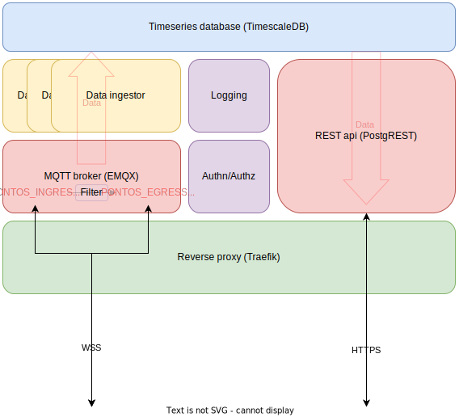

# pontos-hub

This repository contains the blueprint for setting up the PONTOS datahub, developed as part of the PONTOS project.

For further information about the project and how to access the live instance of the PONTOS datahub, see here: https://pontos.ri.se

This repository will describe the technical setup of the datahub.

## Overview

The datahub consists of several containerized applications defined through multiple docker-compose files that together offers the following core functionality:

* A timeseries database ([TimescaleDB](https://github.com/timescale/timescaledb))
* A REST API for the database ([PostgREST](https://github.com/PostgREST/postgrest))
* A MQTT API for the database and for (near) real-time data ([EMQX](https://github.com/emqx/emqx))
* Data ingestion from the MQTT API to the timeseries database ([pontos-data-ingestor](https://github.com/MO-RISE/pontos-data-ingestor))

The core functionality is supported by:

* A reverse proxy ([Traefik](https://github.com/traefik/traefik))
* Automatically generated REST api documentation ([Swagger-UI](https://github.com/swagger-api/swagger-ui))
* A JWT-based authn/authz solution (see below for more details)

## Schematic



## Specifics

### Data format
The hub have some (not a lot) of expectations on the data format that flows in the system:
* The database is configured to use a narrow table setup according to
  ```
  time (TIMESTAMPZ)   |   vessel_id (TEXT)   |   parameter_id (TEXT)   |   value (TEXT)
  ```
* The data ingestor is very flexible in its configuration about how to map data from the MQTT world to the database layout, see https://github.com/MO-RISE/pontos-data-ingestor#specifics. In essence, the only hard requirement is that the payloads are expected to be vaild `JSON`.

#### Pontos project specific data format
Within the Pontos project, a more specific data format has been agreed upon. This data format is described more in detail [here](https://github.com/MO-RISE/pontos-data-format).

### Authn / Authz
The datahub is developed with the primary aim of being an open datahub where anyone can publicly access data. This, however, does not entirely remove the need for a software solution dealing with Authentication / Authorization, for the following anticipated reasons:
* Data producers (connected to the MQTT API) should probably be granted explicit write access to their specific (sub-)topics as a measure to ensure data quality (i.e. anyone cannot just start publishing data to the datahub).
* Open access to the data might anyway require registration, probably as a measure to track access to the data based on some KPIs (Key Performance Indicators).

This repository contains a JWT-based solution capable of enforcing the above anticipated scenarios (and are in active use on the datahub instance operated within the PONTOS project). **NOTE:** The authn/authz features described above are configured in `docker-compose.auth.yml`.

#### REST API
The REST API towards the datahub is provided by [PostgREST](https://github.com/PostgREST/postgrest). For details about how PostgREST handles JWT for authentication and authorization, refer to:
* https://postgrest.org/en/stable/references/auth.html#
* https://postgrest.org/en/stable/references/auth.html#jwt-based-user-impersonation

In essence, PostgREST expects that the JWT contains a field `role` with the name of an existing role within the database. The rights that has been granted to this role are then enforced throughout the http request.

#### MQTT API
The MQTT API towards the datahub is provided by [EMQX](https://www.emqx.io/docs/en/v5.1/). For details about how EMQX handles JWTs for authentication and authorization, refer to:
* https://www.emqx.io/docs/en/v5.1/access-control/authn/jwt.html#jwt-authentication

The MQTT API for the datahub is configured such that:
* There are two root namespaces: `PONTOS` (for incoming data) and `PONTOS_HUB` (for public access) in the mqtt topic structure. This makes it possible to potentially filter data that should not be publicly accessible. By default, no filtering is done between, i.e. all data published to the `PONTOS` root will be available on the `PONTOS_HUB` root.
* Login credentials are required when connecting to the broker (see [here](https://docs.oasis-open.org/mqtt/mqtt/v5.0/os/mqtt-v5.0-os.html#_Toc3901043) for details)
    * The JWT should be passed in the field for the password.
    * The `sub` claim within the JWT is verified to match the username used for login. This authenticates the username. I.e. the username is as expected and not forged.
* Authorization is enforced through access control lists (acl) that may be provided in two ways:
    * As a separate file on disk (see https://www.emqx.io/docs/en/v5.1/access-control/authz/file.html)
    * As part of the JWT `acl` claim (see https://www.emqx.io/docs/en/v5.1/access-control/authn/jwt.html#authorization-list-optional)
* A default acl is bundled with the datahub, see [`acl.conf`](./broker/acl.conf) which gives read access to `PONTOS/#` for everyone.


#### Token generation for read access to the datahub (both via MQTT and REST APIs)
The token generator itself is a bash script (!) packaged as a small containerized microservice with a limited REST API (using [shell2http](https://github.com/msoap/shell2http)). The source code and Dockerfile is available in [auth](./auth/).

The REST API accepts `POST` requests on the `/token` endpoint and returns a JSON Web Token. Any parameter that is sent with the request is encoded into the token payload as additional claims, for example:
```
curl -X POST --location <pontos-hub-hostname>/token \
        -H "Content-Type: application/x-www-form-urlencoded" \
        -d "param1=value1&param2=value2s"
```
would result in a JWT with, among others, the following claims in the payload:
```
...,
"param1": "value1",
"param2": "value2",
...
```

Options are available for requiring and/or disallowing certain claims in the `POST` request. For details, see [here](./tests/20-test-issue-jwt.bats) and [here](./tests/docker-compose.auth-test.yml).

In addition to the user-configurable claims, certain pre-defined claims (see [docker-compose.auth.yml](docker-compose.auth.yml)) are enforced:
* `role`: `web_user`
* `sub`: `__token__`
* `acl`: `(empty)`

The intention is that this endpoint can be used by a frontend to automatically generate valid access tokens.

#### Token generation for write access to the datahub (via MQTT API)
First is first, you will need a tool for creating JWTs, in the examples below we will make use of `jwt-cli` that can be installed as:
  ```
  wget -q -O - https://github.com/mike-engel/jwt-cli/releases/download/5.0.3/jwt-linux.tar.gz | sudo tar xvz -C /usr/local/bin jwt
  ```
**NOTE:** `jwt-cli` also comes bundled with the devcontainer setup in this repository.

To generate a valid token for write access to the MQTT API there are two options:

* Use of file-based acl (i.e. **prepending** rules to the default [`acl.conf`](./broker/acl.conf))
  * Encode a new JWT using the following example as a guideline:
    ```
    jwt encode --iss=pontos-hub --secret='<your-pontos-hub-JWT-secret>' --sub='<your-preferred-username>'
    ```
  * **Prepend** rule(s) to acl.conf that allows `<your-preferred-username>` to publish to certain topics. For details on the syntax of this file, see https://www.emqx.io/docs/en/v5.1/access-control/authz/file.html.
    * This repository contains a bash script for easily generating write acl rules with correct syntax that can be added to the `acl.conf` file. See [generate-publish-acl-rules.sh](./scripts/generate_publish_acl_rules.sh).

* Use of in-JWT acl rules (i.e. define custom acl rules within the JWT itself)
  * Encode a new JWT using the following example as a guideline:
    ```
    jwt encode --iss=pontos-hub --secret='<your-pontos-hub-JWT-secret>' --sub='<your-preferred-username>' '{"acl":{"pub":["PONTOS/<vessel_id>/#"]}}'
    ```
    Which will allow `<your-preferred-username>` to publish data to topics matching `PONTOS/<vessel_id>/#`.


## Deploy

The datahub can be partially configured using environment variables, for example using a `.env` file in conjunction with the docker-compose files. An example `.env` file is included in the repository [here](example.env).

To start the datahub in base mode (no TLS, no auth):

`docker compose -f docker-compose.base.yml up -d`

To start the datahub with auth and TLS support:

`docker compose -f docker-compose.base.yml -f docker-compose.auth.yml -f docker-compose.https.yml up -d`


## Development
The repository includes a devcontainer setup which is the recommended way of creating a development environment. See [here](https://code.visualstudio.com/docs/devcontainers/containers) for a generic get-started in VSCode.

To run the integration test suite:
```cmd
bats tests/
```

## License
See [LICENSE](./LICENSE)
